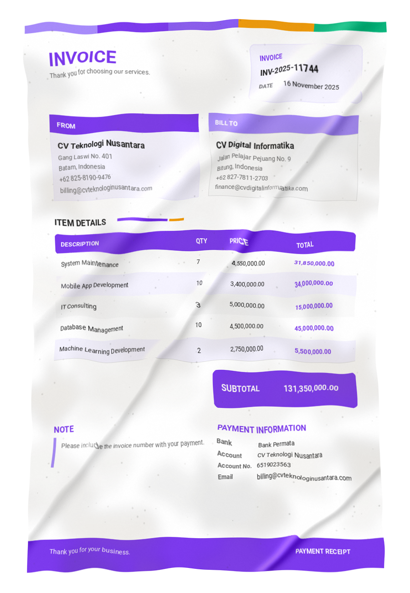

# Invoice Document to Text

An end-to-end deep learning project for building an **image-to-text model for invoice documents**.

The model takes an invoice image as input and generates its structured information as **JSON**. The project covers the complete process from dataset preparation, image preprocessing, tokenizer development, encoder/decoder implementation, model training, evaluation, Hugging Face model publishing, and deployment-oriented workflows.

The model is built using **PyTorch**, with a **Swin Transformer Encoder** for visual feature extraction and a **BART Decoder** for autoregressive text generation.

## Overview

The overall pipeline is:

Invoice Image → Image Preprocessing → Swin Encoder → BART Decoder → JSON

The goal is to transform an invoice image such as:



into structured information such as:

```
{
  "invoice_number": "INV-00123",
  "date": "2026-09-15",
  "customer": "Example Company",
  "items": [
    {
      "name": "Product A",
      "quantity": 2,
      "price": 50000
    },
    {
      "name": "Product B",
      "quantity": 1,
      "price": 75000
    }
  ],
  "subtotal": 175000,
  "total": 175000
}
```

The exact JSON structure depends on the ground-truth schema used during dataset generation and training.

## Technologies

* Python
* PyTorch
* Hugging Face Transformers
* Hugging Face Datasets
* timm
* Swin Transformer
* BART
* MLflow
* Google Vertex AI
* Google Cloud Storage
* Hugging Face Hub

## Dataset

The model is trained using the synthetic invoice dataset:

Hugging Face Dataset:

https://huggingface.co/datasets/ridwanFatur98/synth-invoice

The dataset contains synthetic invoice images together with their corresponding structured ground truth.

The synthetic dataset was created to provide controlled invoice layouts and variations for training an image-to-text document model.

## Model

The final model follows an encoder-decoder architecture:

```
Invoice Image
     |
     v
Image Preprocessing
     |
     v
Swin Transformer Encoder
     |
     v
Visual Features
     |
     v
BART Decoder
     |
     v
Generated Text
     |
     v
Structured JSON
```

### Swin Encoder

The encoder uses a Swin Transformer architecture to extract visual representations from invoice images.

The encoder is responsible for understanding visual information such as:

* Text regions
* Invoice layout
* Tables
* Item rows
* Headers
* Labels
* Spatial relationships

The extracted visual features are passed to the decoder through cross-attention.

### BART Decoder

The decoder uses a BART-based architecture to autoregressively generate the invoice representation.

The decoder receives the visual features from the Swin Encoder and generates the target sequence token by token.

The generated sequence represents the structured invoice information and can then be parsed into JSON.

## Project Structure

The project is organized as a sequence of notebooks covering the development process.

```
.
├── 1. Check Dataset.ipynb
├── 2. Image Preprocess.ipynb
├── 3. Ground Truth Preprocess.ipynb
├── 4. Tokenizer.ipynb
├── 5. Swin Encoder.ipynb
├── 6. BART Decoder.ipynb
├── 7. Full Model.ipynb
├── 8. Simple Train.ipynb
├── 9. Inference.ipynb
├── 10. Upload to HF.ipynb
├── 11. Test Uploaded HF Model.ipynb
├── 12. Load Pretrained Model.ipynb
├── 13. Dataset Loader.ipynb
├── 14. Training Preparation.ipynb
├── 15. Deploy Train.ipynb
├── checkpoints/
├── invoice-doc-to-text/
├── scripts/
├── tensors/
├── tokenizer/
├── wheel/
├── docker-file-pytorch/
├── pipeline.yaml
├── test_pipeline.yaml
└── README.md
```

## Development Workflow

The notebooks are organized to progressively build the model.

### 1. Dataset Inspection

`1. Check Dataset.ipynb`

Inspects the invoice dataset and verifies the available images and ground-truth data.

### 2. Image Preprocessing

`2. Image Preprocess.ipynb`

Experiments with preprocessing invoice images before they are passed to the visual encoder.

### 3. Ground Truth Preprocessing

`3. Ground Truth Preprocess.ipynb`

Converts the structured invoice annotations into a sequence representation suitable for autoregressive training.

### 4. Tokenizer

`4. Tokenizer.ipynb`

Develops and validates the tokenizer used by the decoder to represent the structured invoice output.

### 5. Swin Encoder

`5. Swin Encoder.ipynb`

Develops and tests the Swin Transformer image encoder.

### 6. BART Decoder

`6. BART Decoder.ipynb`

Develops and tests the BART-based decoder, including cross-attention between the decoder and visual encoder features.

### 7. Full Model

`7. Full Model.ipynb`

Combines the Swin Encoder and BART Decoder into the complete image-to-text architecture.

### 8. Simple Training

`8. Simple Train.ipynb`

Provides a simplified local training workflow for validating the complete model.

### 9. Inference

`9. Inference.ipynb`

Runs inference using a trained model and converts invoice images into generated structured output.

### 10. Upload to Hugging Face

`10. Upload to HF.ipynb`

Uploads the trained model and its required configuration/tokenizer files to the Hugging Face Hub.

### 11. Test Uploaded Model

`11. Test Uploaded HF Model.ipynb`

Tests the model directly from its Hugging Face repository.

### 12. Load Pretrained Model

`12. Load Pretrained Model.ipynb`

Demonstrates loading the published model for inference or further development.

### 13. Dataset Loader

`13. Dataset Loader.ipynb`

Builds the dataset loading and batching pipeline used during training.

### 14. Training Preparation

`14. Training Preparation.ipynb`

Prepares the complete training environment, configuration, dataset, model, optimizer, and experiment tracking.

### 15. Deploy Training

`15. Deploy Train.ipynb`

Contains the workflow for running the training process using Google Vertex AI.

## Training

Training is implemented using **PyTorch**.

Experiment tracking is handled using **MLflow**, allowing training runs, parameters, metrics, and artifacts to be tracked across experiments.

The training workflow can be summarized as:

```
Dataset
   |
   v
Preprocessing
   |
   v
PyTorch Dataset / DataLoader
   |
   v
Swin Encoder + BART Decoder
   |
   v
Training
   |
   +------> MLflow Metrics
   |
   +------> Model Checkpoints
   |
   v
Final Model
   |
   v
Hugging Face Hub
```

## MLflow

MLflow is used to track the training experiments.

Tracked information can include:

* Training configuration
* Model configuration
* Hyperparameters
* Training loss
* Validation loss
* Checkpoints
* Training artifacts
* Final model artifacts

This makes it possible to compare experiments and identify the model configuration used for the final model.

## Google Vertex AI

The larger training runs are designed to run on **Google Vertex AI**.

Vertex AI is used to provide GPU-based training infrastructure without requiring the training environment to run entirely on the local machine.

The project includes pipeline configuration files:

```
pipeline.yaml
test_pipeline.yaml
```

The training workflow can use Google Cloud Storage for datasets, packages, MLflow artifacts, and model checkpoints.

A simplified training flow is:

```
Local Development
      |
      v
Vertex AI Pipeline
      |
      v
GPU Training
      |
      v
MLflow Experiment Tracking
      |
      v
Model Checkpoint
      |
      v
Hugging Face Hub
```

## Model Repository

The latest trained model is published on Hugging Face:

https://huggingface.co/ridwanFatur98/invoice-doc-to-text

The repository contains the model implementation and artifacts required to load and run the trained model.

## Dataset Repository

The synthetic invoice dataset is available here:

https://huggingface.co/datasets/ridwanFatur98/synth-invoice

## Inference

After loading the trained model, an invoice image can be passed through the preprocessing pipeline and then processed by the encoder-decoder model.

The high-level inference process is:

```
Invoice Image
     |
     v
Preprocess Image
     |
     v
Swin Encoder
     |
     v
BART Decoder
     |
     v
Generated Sequence
     |
     v
Parse JSON
     |
     v
Structured Invoice Data
```

The model is intended to perform the complete document understanding task without requiring a separate OCR engine followed by an LLM.

## Project Goal

This project is primarily a learning and experimentation project focused on understanding how an end-to-end document image-to-text model can be built from its individual components.

The development process covers:

1. Dataset inspection
2. Image preprocessing
3. Ground-truth serialization
4. Tokenizer construction
5. Swin Transformer implementation
6. BART decoder implementation
7. Encoder-decoder integration
8. PyTorch training
9. MLflow experiment tracking
10. GPU training with Google Vertex AI
11. Model checkpointing
12. Hugging Face model publishing
13. Model loading and inference

The final result is an invoice document model that maps an invoice image directly to structured JSON.

## References

* Dataset: https://huggingface.co/datasets/ridwanFatur98/synth-invoice
* Model: https://huggingface.co/ridwanFatur98/invoice-doc-to-text
* Hugging Face: https://huggingface.co/
* PyTorch: https://pytorch.org/
* MLflow: https://mlflow.org/
* Google Vertex AI: https://cloud.google.com/vertex-ai
* Swin Transformer: https://arxiv.org/abs/2103.14030
* BART: https://arxiv.org/abs/1910.13461
